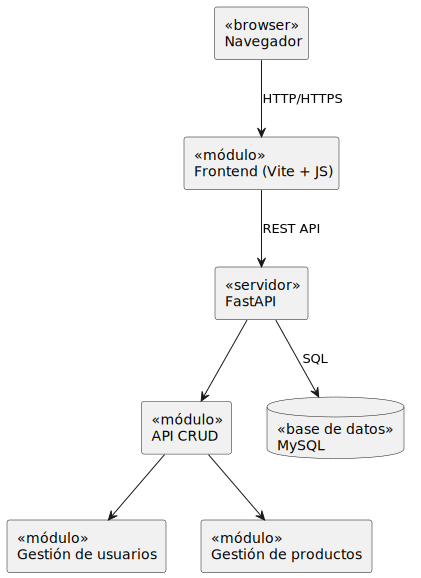
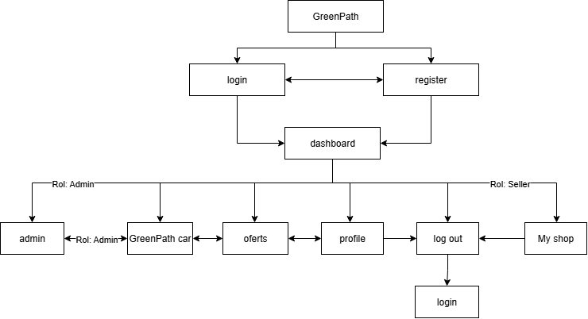

# GreenPath Market

## Description

GreenPath Market is an innovative e-commerce platform designed to connect rural farmers and producers directly with consumers and companies, eliminating intermediaries and promoting sustainable agriculture. The platform provides a digital marketplace where producers can sell their goods, manage their shops, and reach a wider audience, while consumers can discover and purchase fresh, sustainable products.

## Features

- User registration and authentication
- Shop management for producers
- Product catalog with categories
- Search and discovery functionality
- Shopping cart and order management
- Payment processing
- Admin panel for platform management
- Responsive design for mobile and desktop
- Real-time inventory management

## Tech Stack

### Backend
- **FastAPI**: High-performance web framework for building APIs
- **SQLAlchemy**: ORM for database interactions
- **Pydantic**: Data validation and serialization
- **MySQL**: Database management system

### Frontend
- **Vanilla JavaScript**: No framework dependencies
- **HTML5**: Semantic markup
- **CSS3**: Modern styling with custom properties
- **Vite**: Fast build tool and development server
- **Axios**: HTTP client for API requests

### Database
- **MySQL**: Relational database
- **Entity-Relationship Diagram**: Database schema design

## Project Structure

```
greenpath_market/
├── backend/                 # FastAPI backend
│   ├── api/                # API endpoints
│   ├── crud/               # Database operations
│   ├── models/             # SQLAlchemy models
│   ├── schemas/            # Pydantic schemas
│   ├── config/             # Configuration
│   ├── db/                 # Database setup
│   └── main.py             # Application entry point
├── frontend/                # Vanilla JS frontend
│   ├── src/
│   │   ├── assets/         # CSS, JS, images
│   │   ├── views/          # HTML pages
│   │   └── components/     # Reusable components
│   ├── index.html          # Landing page
│   └── vite.config.js      # Build configuration
├── database/                # Database scripts and docs
│   ├── scripts/            # SQL scripts
│   └── README.md           # Database documentation
├── docs/                   # Additional documentation
└── README.md               # This file
```

## Installation and Setup

### Prerequisites
- Python 3.8+
- Node.js 14+
- MySQL 8.0+

### Backend Setup
1. Navigate to backend directory:
   ```bash
   cd backend
   ```

2. Create virtual environment:
   ```bash
   python -m venv .venv
   source .venv/bin/activate  
   ```

3. Install dependencies:
   ```bash
   pip install -r requirements.txt
   ```

4. Set up database configuration in `.env` file

5. Run the application:
   ```bash
   fastapi dev main.py
   ```

### Frontend Setup
1. Navigate to frontend directory:
   ```bash
   cd frontend
   ```

2. Install dependencies:
   ```bash
   npm install
   ```

3. Start development server:
   ```bash
   npm run dev
   ```

### Database Setup
1. Run the database initialization scripts in `database/scripts/`
2. Configure connection in backend config

## Usage

1. Start the backend server
2. Start the frontend development server
3. Access the application at `http://localhost:5173`
4. API documentation available at `http://localhost:8000/docs`

## API Documentation

For detailed API endpoints and usage examples, see [Backend README](backend/README.md)

## Contributing

1. Fork the repository
2. Create a feature branch
3. Make your changes
4. Test thoroughly
5. Submit a pull request

## License

This project is licensed under the MIT License - see the [LICENSE](LICENSE) file for details.

## Team

- **Juan Cardona** - Development & Design
- **Forlan Ordoñez** - Development & Design
- **Daniel Rojas** - Development
- **Camilo Parra** - Development
- **Wilson Delgado** - Development

**GreenPath Market** - Empowering rural producers through digital innovation 🌱
## Components Diagram


## Navigation Diagram


## Links
- [Frontend Documentation](frontend/README.md)
- [Backend Documentation](backend/README.md)
- [Database Documentation](database/README.md)
